# Arquitecturas empresariales - Taller de de modularización con virtualización e Introducción a Docker y a AWS

--------------------------------------------------------------------------------------------------------------

El objetivo esconstruir una aplicación con la arquitectura descrita en la siguiente imagen

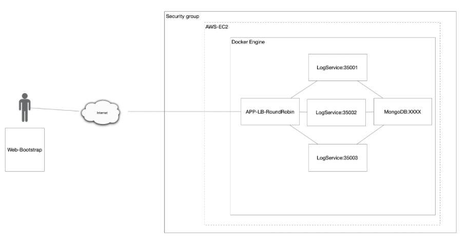

y desplegarla en AWS usando EC2 y Docker

--------------------------------------------------------------------------------------------------------------

## Descarga y instalación

Para clonar este repositorio basta con copiar la siguiente linea en un Shell de cualquier sistema operativo

```
git clone https://github.com/Edyesid/AREP-SparkDockerAws
```

Es recomendable tener instalado maven en su computadora para poder visualizar de una mejor manera las pruebas y compilación del taller. para esto dirijase al pagina de maven y siga los pasos de instalación.

[install maven](https://maven.apache.org/install.html)

## Pasos y pruebas

El servicio implementado es una pagina web que recibe una palabra y esta se almacena en una base de datos mongo con la fecha de creación de la palabra, esto se hacer mediante 
una peticion post /add

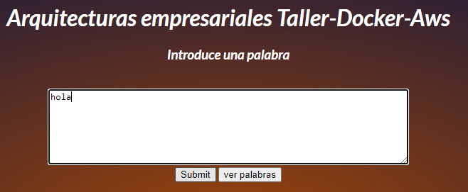

Las palabras de la base de datos se puede consultar mediante una peticion get /descripciones que mostrara una lista de palabras y fechas en formato Json

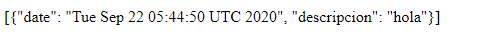

Se crearon los 3 contenedores para el servicio, una para el balanceador de carga y una para la base de datos mongo en Docker

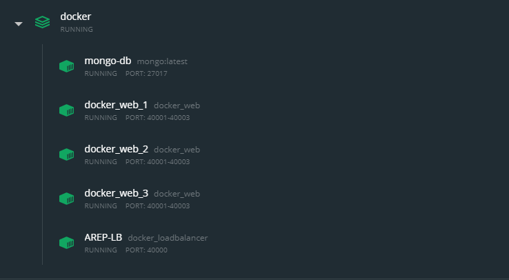

Se crearon dos repositorios en la cuenta de docker hub

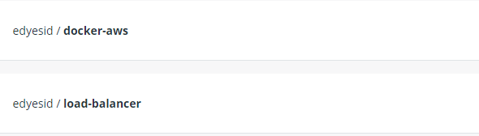

Por ultimo se subieron las imagenes de docker en una maquina de aws y se probo que funcionara correctamente

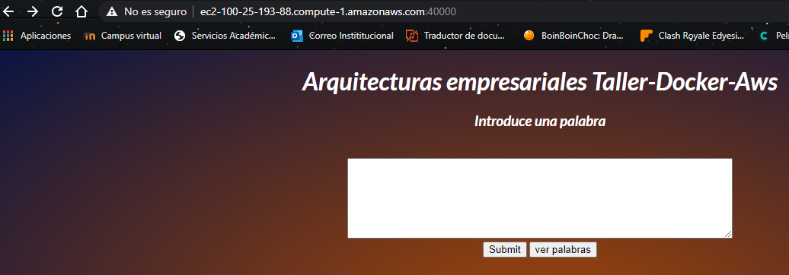

## Pasos taller

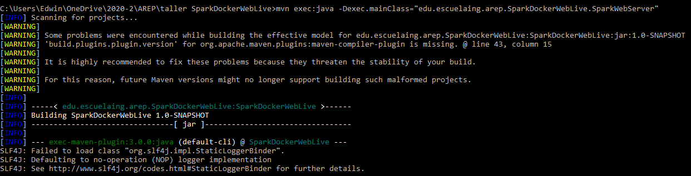

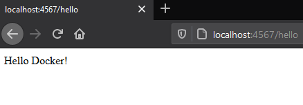

Use docker-compose para generar automáticamente una configuración docker.

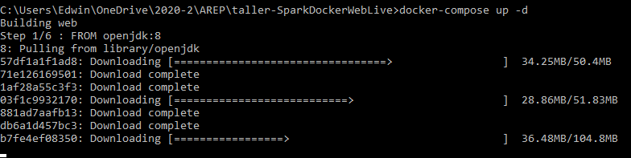

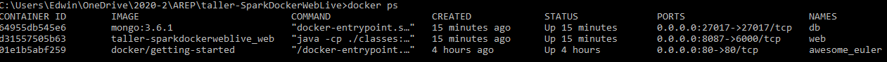

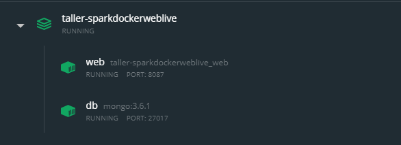

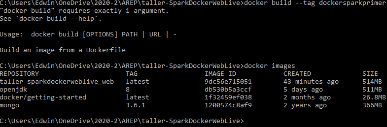

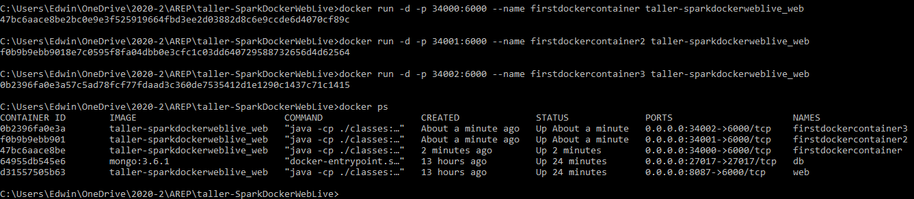

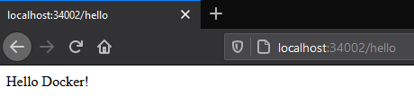

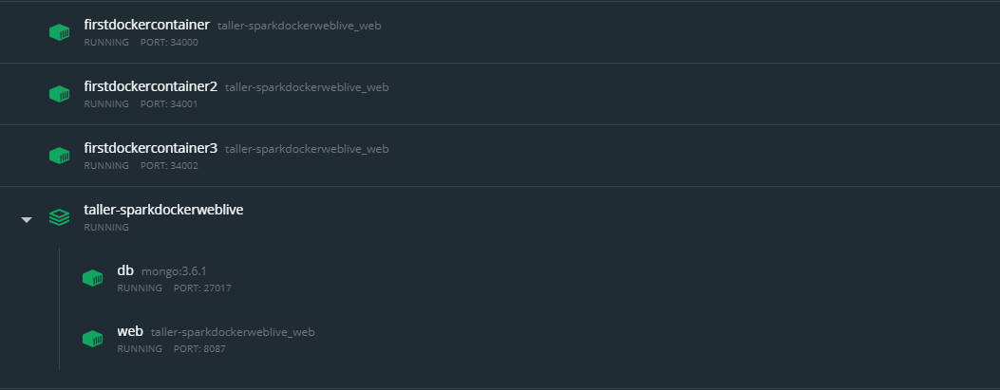

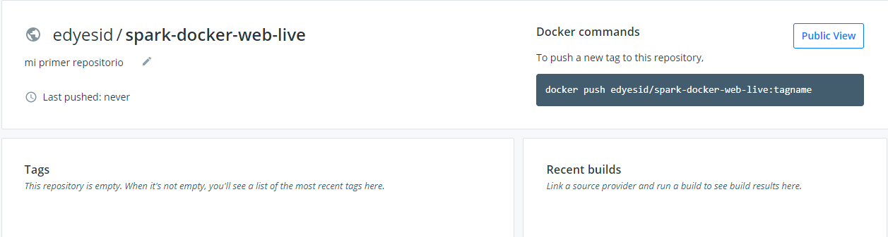

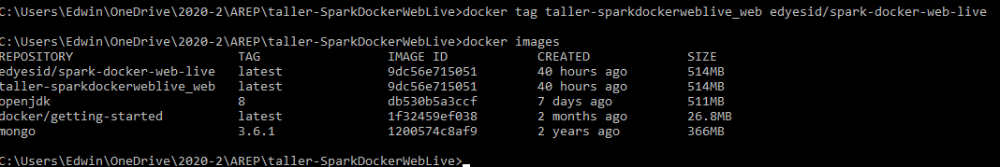

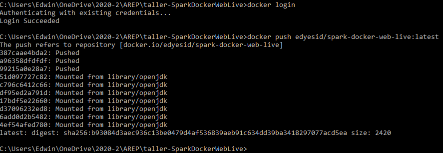

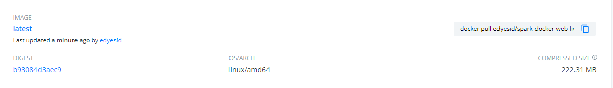

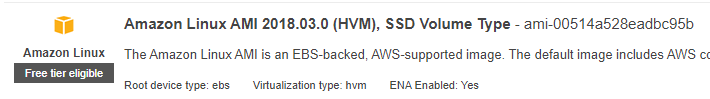

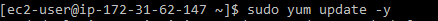

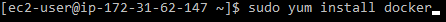

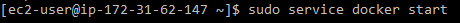

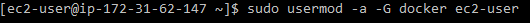

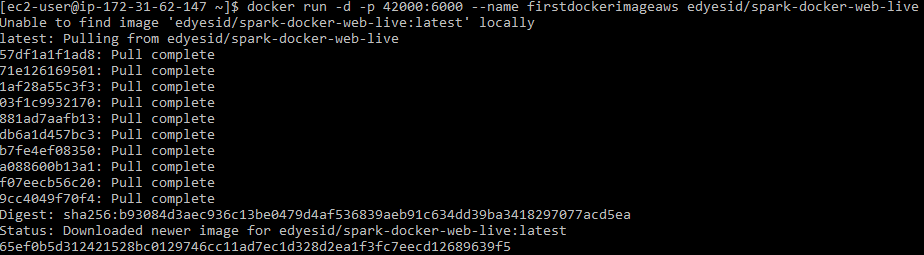

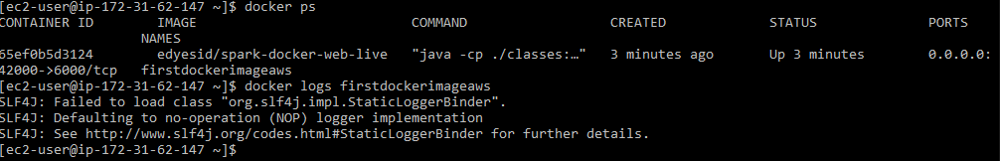

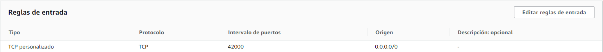

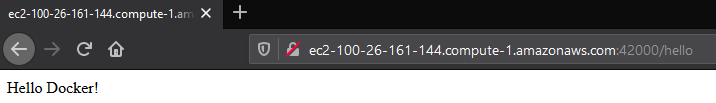

## Construido

[Eclipse](https://www.eclipse.org/) plataforma de código abierto para el desarrollo de aplicaciones
[IntelliJ IDEA](https://www.jetbrains.com/es-es/idea/)

## Autor

Edwin Yesid Rodriguez Maldonado

## Licencia

Este proyecto esta bajo la licencia GNU GENERAL PUBLIC LICENSE
